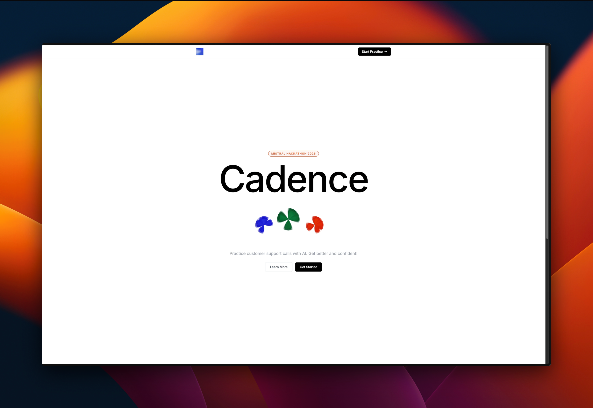

<p align="center">
  <h1 align="center"><b>Cadence</b></h1>
  <p align="center">
    AI-powered customer support training simulator for BPO agents.
    <br />
    <br />
    <a href="https://cadence.dinogomez.app">Live Demo</a>
    ·
    <a href="https://github.com/dinogomez/cadence/issues">Issues</a>
  </p>
</p>

Practice handling difficult customer calls with AI personas that react authentically to everything you say — escalating when you deflect, calming down when you empathize, and ending the call when the issue is resolved or they've had enough.

---

## What it does

Cadence puts you on a live call with an AI customer. You speak, they respond in voice. Say the wrong thing and they get angrier. Handle it well and they calm down. Every turn is evaluated in real time and a full scorecard is generated at the end.

**The training loop:**

1. Pick a customer persona and scenario
2. The AI generates a unique call briefing — customer name, company, account details, situation
3. The call starts — the customer speaks first (or waits for your intro)
4. You hold Space (or tap and hold on mobile) to speak
5. Live coaching flags appear after each turn
6. The call ends when the issue resolves, the customer hangs up, or you end it manually
7. A scored assessment covers Empathy, English, Compliance, and Resolution

---

## Customer personas

| Persona | Type | Challenge |
|---|---|---|
| Angry Regular | Frustrated Customer | Interrupts, escalates fast, responds to real empathy |
| Confused Senior | Elderly Caller | Repeats herself, goes off-topic, needs patience |
| Firm Canceller | Cancellation Intent | Cold and decisive, dismisses generic retention offers |
| Frustrated Dev | Technical Support | Already tried everything, wants L2 escalation, will call out basic steps |
| Impatient Exec | High-Value Customer | No time, name-drops, expects VIP treatment immediately |
| First-Time Caller | New Customer | Nervous, over-explains, needs to be guided |
| Aggressive Disputer | Billing Dispute | Accuses, threatens, wants validation before solutions |
| Language Barrier | ESL Speaker | Mishears, rephrases, needs clarity and patience |

---

## Scenarios

Pre-built scenarios across retail, billing, telecom, SaaS, and banking — each with generated policy facts, account details, and a randomized situation so no two calls are the same. Custom scenarios are also supported.

---

## Tech stack

| Layer | Tech |
|---|---|
| Speech-to-text | [Voxtral](https://mistral.ai/news/voxtral) (Mistral) |
| Customer AI | [Mistral Large](https://mistral.ai) |
| Turn evaluation | Ministral 8B |
| Text-to-speech | [ElevenLabs](https://elevenlabs.io) |
| Frontend | React 19 + Vite + Tailwind CSS |
| Backend | Node.js + Hono + WebSockets |
| Deployment | Railway |

---

## How it works

```
Agent speaks → Voxtral STT → agent transcript
                                    ↓
              ┌─────────────────────┴─────────────────────┐
              ↓                                           ↓
    Mistral Large                               Ministral 8B
  (customer response                         (turn evaluation:
   + escalation level                    empathy, english, compliance,
   + end condition)                            resolution, flags)
              ↓                                           ↓
         ElevenLabs TTS                       Live coaching panel
         (customer voice)                              ↓
              ↓                              Score bars update
    Customer speaks back
```

All calls are stateless — the client sends the full conversation history with every turn. The backend holds no session state between messages.

---

## Running locally

### Prerequisites

- Node.js 18+
- Mistral API key
- ElevenLabs API key + voice IDs

### Setup

```bash
# Clone
git clone https://github.com/dinogomez/cadence
cd cadence

# Backend
cd backend
cp .env.example .env
# Fill in your API keys
npm install
npm run dev        # http://localhost:3001

# Frontend (new terminal)
cd frontend
cp .env.example .env
npm install
npm run dev        # http://localhost:5173
```

### Backend `.env`

```env
MISTRAL_API_KEY=...
ELEVENLABS_API_KEY=...

# One or more ElevenLabs voice IDs per persona (comma-separated)
ELEVENLABS_VOICE_ANGRY_MARK=...
ELEVENLABS_VOICE_LOLA_CARMEN=...
ELEVENLABS_VOICE_FIRM_ANDREA=...
ELEVENLABS_VOICE_FRUSTRATED_DEV=...
ELEVENLABS_VOICE_IMPATIENT_EXEC=...
ELEVENLABS_VOICE_FIRST_TIME_CALLER=...
ELEVENLABS_VOICE_AGGRESSIVE_DISPUTER=...
ELEVENLABS_VOICE_LANGUAGE_BARRIER=...

ALLOWED_ORIGIN=http://localhost:5173
```

### Frontend `.env`

```env
VITE_API_URL=http://localhost:3001
VITE_WS_URL=ws://localhost:3001
```

---

## Built for

[Mistral Hackathon 2026](https://worldwide-hackathon.mistral.ai/) — Team Bluerock
